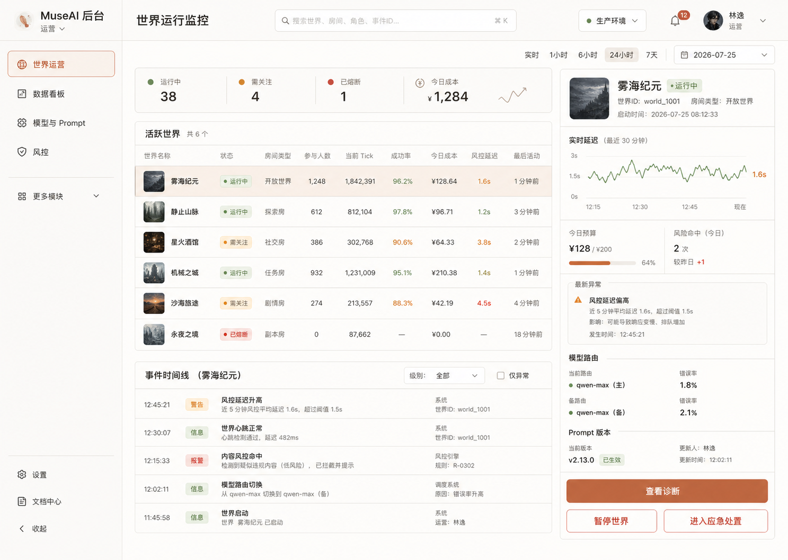
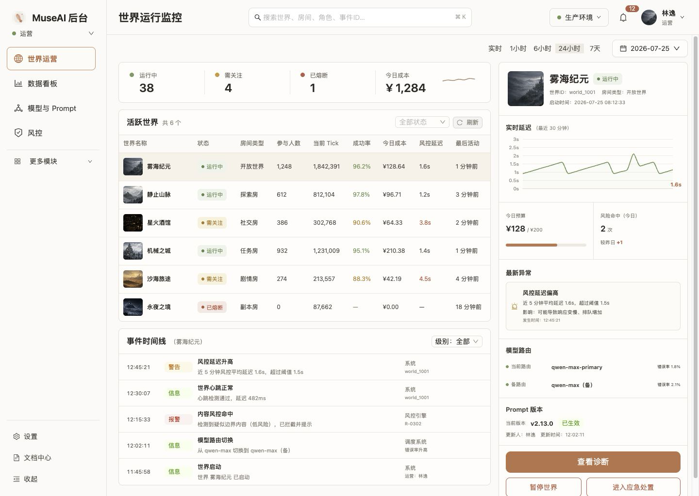
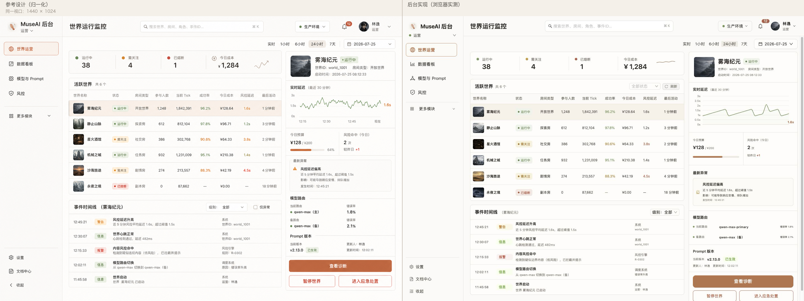

# MuseAI 管理后台界面设计

> 选定方案：Option 3「世界运营指挥台」  
> 状态：已实现并通过视觉验收  
> 适用范围：独立 Web 管理后台  
> 验收基线：1440 × 1024，设备像素比 1  
> 最后更新：2026-07-26

## 1. 设计结论

后台采用独立 Web 应用，不并入普通用户客户端。选定的 3 号方案以“世界运行监控”为默认工作台，强调运营人员在一个视口内完成发现异常、定位世界、查看诊断和执行处置。

后台不是面向用户的内容大厅，因此视觉上保持高信息密度、低装饰性和明确的风险状态。整体沿用客户端的暖白与陶土色品牌语言，但通过更紧凑的表格、指标条和诊断栏体现管理工具属性。

## 2. 视觉参考与最终实现

### 2.1 选定参考设计

### 2.2 最终实现

### 2.3 并排验收

聚焦对照：

- [主监控区](./assets/admin-main-compare.png)
- [右侧诊断区](./assets/admin-inspector-compare.png)

## 3. 后台信息架构

| 模块 | 核心职责 | 主要使用者 |
|---|---|---|
| 世界运营 | 运行状态、世界诊断、暂停/恢复、应急处置 | 运营、值班人员 |
| 数据看板 | 平台规模、留存、活跃、成本和质量指标 | 运营、管理者 |
| 模型与 Prompt | 模型路由、错误率、Prompt 版本与发布 | 模型运营、技术运营 |
| 风控 | 审核、风险命中、封禁与申诉协同 | 风控、审核人员 |
| 更多模块 | 世界模板及低频管理入口 | 对应权限角色 |
| 设置与文档 | 系统设置、操作说明、侧栏收起 | 全部后台角色 |

菜单由 RBAC 决定是否显示。设计预览使用运营角色，仅展示其可见模块；正式模式继续使用原有管理端鉴权和权限判断。

## 4. 页面布局规格

| 区域 | 规格 | 设计目的 |
|---|---|---|
| 左侧栏 | 220px | 品牌、角色、主模块和低频入口保持稳定 |
| 顶栏 | 72px | 页面标题、全局搜索、环境、通知和账号 |
| 主工作区 | 自适应；≥1361px 视口最小 680px，更窄视口放开最小宽度 | 健康指标、活跃世界表格、事件时间线 |
| 诊断栏 | 390px（所有视口不变） | 选中世界的实时诊断和运营操作 |
| 主/辅间距 | 16px | 保持高密度但不粘连 |
| 页面内边距 | 左 24px、右 8px、上 8px | 与参考图的几何边界对齐 |

后台设置 `min-width: 1100px`，适合桌面运营场景。

几何自洽核算：侧栏 220 + 页面内边距 32（左 24 + 右 8）+ 主区 680 + 主辅间距 16 + 诊断栏 390 = **1338px**；再加内容区纵向滚动条（经典滚动条约 15px）实际需 **约 1353px**。因此完整设计几何只在 ≥1361px 视口成立，1100–1360px 由以下断点承接，保证 `min-width: 1100px` 的承诺是真的：

| 断点 | 变化 | 说明 |
|---|---|---|
| ≤1360px | 主区最小宽度由 680px 放开为 0；健康指标格最小宽收紧为 84px×3 + 196px；时间线行列宽收紧；指标格左右内边距 22px→14px | 诊断栏仍为 390px；活跃世界表格（最小 760px）改为在面板内部横向滚动，不撑宽页面 |
| ≤1160px | 健康指标条折为 2×2 | 一行四格最少需约 448px 主区宽度，低于此宽度四项无法完整显示 |

实测（Chrome 150 headless，DPR 1）：1100 / 1160 / 1161 / 1200 / 1280 / 1360 / 1361 / 1440px 八档视口下，`document.documentElement.scrollWidth` 均等于视口宽度，`.admin-shell__content`、`.world-console__grid`、健康指标条、时间线、诊断栏均无容器级横向溢出；表格行高 58px、表头 36px、诊断栏 390px 保持不变。

## 5. 视觉系统

| 用途 | 颜色/样式 |
|---|---|
| 页面底色 | `#fbfaf7` |
| 面板底色 | `#fffdfa` |
| 主文字 | `#292724` / `#38342f` |
| 分隔线 | `#e4ded6` / `#e7e1da` |
| 品牌与主操作 | 陶土色 `#c96845` / `#d37a57` |
| 正常状态 | 鼠尾草绿 `#5d8750` / `#749b63` |
| 需关注 | 琥珀色 `#bb7623` / `#d99535` |
| 熔断或高风险 | 红色 `#c64d40` / `#ca5547` |
| 面板圆角 | 8px |
| 表格行高 | 58px；表头 36px |

状态必须同时出现文字和颜色，例如“运行中”“需关注”“已熔断”，不能只显示彩色圆点。

上表是唯一权威：品牌色、状态色与分隔线不得出现表外近似值（历史上出现过的 `#c96d49`、`#c86843`、`#cf704d`、`#dc8a69`、`#6f985e`、`#d8943a`、`#c95345` 等已全部收敛到表内值，antd 主题 token 同步）。中性文字灰阶与状态底色浅色调不在本表范围内。

## 6. 世界运行监控

### 6.1 健康指标条

首屏固定展示：

- 运行中世界数。
- 需关注世界数。
- 已熔断世界数。
- 今日成本及趋势。

指标条用于快速判断平台是否进入异常状态，不承担完整数据分析；详细趋势应进入数据看板。

### 6.2 活跃世界表格

当前字段包括世界名称、状态、房间类型、参与人数、当前 Tick、成功率、今日成本、风控延迟和最后活动时间。世界名称带缩略图：真实封面取 `GET /admin/worlds` 的 `coverUrl`（**仅机审 approved 才下发**，未过审等同没有封面）；该键缺席时按 `world.id` 哈希确定性取兜底图，同一世界恒定同一张，既不全站同图也不随机。**点击整行**即为主入口，键盘 Enter / 空格等效，随即更新右侧诊断栏。

状态筛选、刷新和时间范围切换属于核心操作，必须保持可用：

- 状态筛选覆盖运行中、需关注、已暂停、已熔断、已结束五档；`paused` / `ended` 下推服务端过滤，`running`（含库值 `open`）与派生态 `attention` / `fused` 在前端过滤。
- 时间范围（实时 / 1 小时 / 6 小时 / 24 小时 / 7 天）真实决定实时延迟曲线与事件时间线的取数窗口，不是纯装饰控件。

表格在窄视口可在面板内部横向滚动，但不能把整个后台页面撑宽。

### 6.3 事件时间线

时间线跟随当前选中世界，显示事件时间、级别、事件标题、说明和来源。警告、信息、报警等状态使用不同标签，并保留文字名称。

事件由该世界诊断接口的 tick 元数据派生：`failed` → 报警（附错误码中文说明），耗时超过告警阈值 → 警告，其余 → 信息。级别筛选（全部 / 仅异常）与时间范围同时生效；窗口内无事件时显示空态而非样本数据。一屏最多渲染 10 条，超出只提示总数。

## 7. 右侧诊断栏

诊断栏始终对应当前选中的世界，组成如下：

1. 世界摘要：封面、名称、运行状态、世界 ID、房间类型、启动时间和创建时间。
2. 实时延迟：曲线（窗口由顶部时间范围决定，「实时」= 最近 30 分钟）、当前值和告警阈值。阈值以红色虚线 + 阈值以上告警区间渲染，当前值超阈值时转告警色。
3. 今日预算与风险命中：预算消耗进度、风险命中次数及日环比。
4. 最新异常：取窗口内最近一条非「信息」级事件；无异常时显示空态。
5. 模型路由：主路由、备用路由和错误率。
6. Prompt 版本：当前生效版本、更新人和更新时间。
7. 操作区：查看诊断、暂停/恢复世界、进入应急处置。

延迟与成本趋势使用 ECharts，不使用手写 SVG 或装饰性假图。视觉参考图中的曲线仅定义风格，正式数据形状由接口结果决定；窗口内无 tick 数据时显示空态，不回填样本曲线。第 3、5、6 项中后端尚无数据源的部分见 §9.1。

## 8. 运营操作与安全约束

### 暂停/恢复世界

1. 操作员选中世界。
2. 点击“暂停世界”或“恢复世界”。
3. 弹窗要求填写操作理由；理由可选，但必须写入审计链路。
4. 确认后调用正式后台接口，成功反馈并刷新状态。

### 应急处置

- “进入应急处置”跳转风控模块，不在监控页复制一套封禁或审核流程。
- 高风险操作必须受权限约束，并在服务端再次校验，不能只依赖前端隐藏按钮。
- 生产环境必须展示真实环境标识，避免运营人员在错误环境执行操作。判定顺序：构建注入的 `VITE_ADMIN_ENV` → Vite dev 模式 → 接口基址为本地回环 → 判不出来时显示「环境未知」。不得用 `import.meta.env.MODE === 'production'` 直接判生产（同一份产物可部署到任意环境）；非生产或未判定时环境圆点转琥珀色。

## 9. 设计预览与正式数据

- 开发验收地址：`http://127.0.0.1:1430/worlds?design=preview`。
- `design=preview` 仅在开发环境注入六个可操作的世界样本。
- 正式模式继续使用 `/admin/worlds`、世界诊断和暂停/恢复接口。
- 预览数据可以验证交互和视觉，但不能作为后台接口已经稳定、指标口径已经确认或生产可用的证据。

### 9.1 正式模式的空态字段（数据诚实纪律）

按 `docs/VALIDATION.md` §0 状态语言：正式模式只渲染接口真实返回的字段，后端没有的一律显示 `—` / 空态，代码就地留 `TODO(接口缺字段)`，**不得用常量冒充真实能力**。当前空态清单与所需后端字段：

| 界面位置 | 现状 | 需要的后端字段（建议端点） |
|---|---|---|
| 健康指标条 运行中/需关注/已熔断 | 按“已加载世界”本地统计，翻页未完时标注“未加载完” | 平台级汇总（`GET /admin/worlds/summary`）。`metrics/overview` 的 `worlds.active/fused` 是另一套口径（无“需关注”档、与本页派生态不一致），不能顶替 |
| 表格 风控延迟 | `—` | `moderationLatency`（`GET /admin/worlds`）。全仓无任何一处记录**机审调用耗时**；`audit_queue.created_at/reviewed_at` 是**人审周转**（小时/天量级），与本列按秒渲染的语义不同，**不得充数**。补齐路径：safety 侧在 `moderate_*` 两端取时钟差落表后按 world 聚合 |
| 表格 最后活动 | `—` | `lastActivityAt`（`GET /admin/worlds`）。`worlds.updated_at` 已存在但未投影；`createdAt` ≠ 最后活动 |
| 诊断栏 启动时间 | `—`，另显示真实创建时间 | `startedAt`（diagnostics.world） |
| 诊断栏 风险命中 | 口径改为“累计”，日环比 `—` | 按日聚合的 `riskEventCountsToday` 与昨日值 |
| 诊断栏 备用路由 / 路由错误率 | `—`，当前路由旁改显示真实 Tick 失败率 | `backupRoute`、`routeErrorRate` |
| 诊断栏 Prompt 更新人 / 更新时间 | `—` | `promptSetUpdatedBy`、`promptSetUpdatedAt` |
| 延迟曲线与时间线取数窗口 | 客户端按时间范围过滤 diagnostics 最近 10 个 tick | diagnostics 支持 `?since=` / `?window=` 与更大采样量 |

已由成本仪表与世界封面（`server/src/admin_api/worlds_ops.rs`、`dashboards.rs`）补齐并接线的字段，前端不再留空态；**单位口径必须照下表渲染**：

| 界面位置 | 数据来源 | 单位与空值口径 |
|---|---|---|
| 表格 / 诊断栏 世界缩略图 | `GET /admin/worlds` → `coverUrl` | 🔴 只有机审 `approved` 的封面才下发（服务端经 `worlds::visible_cover_url` 这一个闸门，与玩家大厅同源）；无封面 / `pending` / `rejected` → **该键缺席**（不是空串、不是 `null`），前端按 `world.id` 哈希取确定性兜底图，**不得随机、不得全站同图** |
| 表格 参与人数 | `GET /admin/worlds` → `participantCount` | active 成员数；无成员即 `0`（0 是真实答案，不是缺数据） |
| 表格 成功率 | `GET /admin/worlds` → `successRate` | **0..1 小数**，渲染必须 ×100；分母只含已终结 tick（done+failed）；无已终结 tick → `null`，显示 `—` 且不着色，**不得当 0% 渲染** |
| 表格 今日成本 | `GET /admin/worlds` → `todayCostCents`（账面整数分）/ `todayCostCny`（展示派生）/ `todayTokens` | UTC 日界；单元格显示 `¥x.xx`，tooltip 附今日 token |
| 健康指标条 今日成本 + 迷你趋势 | `GET /admin/metrics/overview` → `cost.today.cny` / `cost.trend[].cny` | 平台合计，UTC 日界；趋势默认近 7 日（`?costDays=` 覆盖，clamp [1,60]），末桶即今天；日桶不足 2 个不画曲线；取数失败退回 `—`，不阻断监控主流程 |
| 诊断栏 今日预算 | `GET /admin/worlds/{id}/diagnostics` → `budget.spentCny` / `dailyCnyBudget` / `usageRatio` / `tokenUsageRatio` / `spentTokensTodayEffective` | 金额账面为整数分，`*Cny` 仅展示；三个用量比均为 **0..1 小数**，`usageRatio` 取 token 与金额两维**较大者**（先触线的那条）；某维未设上限 → 该维比为 `null`，显示「未设金额上限」且不画进度条，**禁止回退成 0%**；跨日陈旧计数器由 server 归零（`spentTokensTodayEffective`），前端不再自判日界 |

单价参数为 `MUSE_TOKEN_CNY_CENTS_PER_1K`（分/千 token），与 runtime 预算熔断同源；每玩家成本按 active 成员人均等分，戏份极不均的世界会低估重度玩家（口径自述见 `cost.allocation` / `cost.notes[]`）。

**错峰调度成本仪表**（migration 0038）不在本监控页，落在**数据看板**（`admin/src/pages/Metrics.tsx`），读同一个 `GET /admin/metrics/overview` 的 `cost.offPeak`：错峰拍/ token 占比、估算折让、平均延后时长、名义档位分桶，以及逐日「折扣时段 / 原价时段」token 构成（来自 `cost.trend[].offPeakTokens`，与当日 `tokens` 是**包含**关系，不可相加）。单位口径照下述渲染，与本节其余成本字段同一套约定：

- `tickRatio` / `tokenRatio` / `savedRatio` / `priceRatio` 均为 **0..1 小数**，走 `formatPercent`（内部 ×100）；窗口内无 tick → `null`，显示 `—`，**不得当 0% 读**。
- 🔴 `priceRatioPct` 是**百分数整数**（`100` = 原价、`50` = 5 折），直接带 `%` 渲染，**绝不能喂进 `formatPercent`**（会渲染成 5000%）。
- 金额账面为整数分（`*Cents`），`*Cny` 仅展示；折让是**估算**（名义档位 × 单价），不是供应商账单，界面须自述该局限。
- 错峰调度默认关闭（`MUSE_OFFPEAK_SCHEDULING`，VALIDATION §0.1）：关闭时 `offPeakTicks = 0`、各比率为真实的 `0.0`，图表位显示「没有错峰拍 / 默认关闭」空态而非报错，四张指标卡照常显示真实的 0 值。

`最新异常` 与 `事件时间线` 由 `diagnostics.ticks`（tick 状态、错误码、耗时、token）派生，跟随当前选中世界；延迟告警阈值、「需关注」预算比例与成功率告警分档目前是前端展示分档常量，服务端下发后应改读接口。

## 10. 实现映射

| 能力 | 主要文件 |
|---|---|
| 后台外壳、导航、RBAC 显示 | `admin/src/App.tsx` |
| 全局视觉规范 | `admin/src/admin.css` |
| Ant Design 主题 | `admin/src/main.tsx` |
| 世界运营路由与模板入口 | `admin/src/pages/WorldsOps.tsx` |
| 世界运行监控 | `admin/src/pages/WorldsMonitorConsole.tsx` |
| 监控页样式 | `admin/src/pages/WorldsMonitorConsole.css` |
| 世界视觉资产 | `admin/public/assets/worlds/` |
| 社交举报队列（§14） | `admin/src/pages/SocialReports.tsx` / `SocialReports.css` |
| 已过审内容处置（§15） | `admin/src/components/ContentDisposal.tsx`（内容审核页第三个 Tab）|
| RBAC 模块表与角色映射 | `admin/src/rbac.ts` |

## 11. 验收记录

- 世界选择后诊断栏会更新，已验证“静止山脉”切换。
- 点击整行（含非世界名单元格）即切换诊断栏与事件时间线，已用第 3 行第 5 列验证；表格行 `tabIndex=0`，键盘可达。
- 时间范围切换真实改变取数窗口：1 小时 / 24 小时 / 7 天下延迟曲线标题、时间线窗口与事件时间格式（7 天转 `MM/DD HH:mm`）同步变化。
- 状态筛选五档均可用，「需关注」筛出 2 个、「已熔断」筛出 1 个，与表格状态列一致。
- 暂停世界理由弹窗、确认、状态更新和成功反馈均已验证；恢复沿用同一逻辑。
- “更多模块 → 世界模板”入口和返回监控页可用。
- 六张世界图片全部加载成功且自然尺寸有效。
- 1100 / 1160 / 1161 / 1200 / 1280 / 1360 / 1361 / 1440px 八档视口无页面级与容器级横向溢出（Chrome 150 headless，DPR 1）。
- 全新验收标签页控制台 warning/error 为 0（含正式模式后端不可达时的降级路径）。
- 正式模式（后端不可达）降级验证：健康指标条为真实统计值、今日成本显示 `—`、表格与时间线、诊断栏均为空态，无任何硬编码样本数字。
- `npx tsc --noEmit` 与 `npm run build` 通过。
- 最终视觉问题：P0 无、P1 无、P2 无；曲线数据与生成式参考图、系统字体笔画存在可接受的 P3 差异。

## 12. 后续建设优先级

1. 对齐正式诊断接口字段、空值语义、刷新频率和错误状态。
2. 定义暂停、恢复、熔断、封禁和应急处置的权限矩阵及双重确认规则。
3. 将每次管理操作接入可查询的审计日志，并显示执行结果而不只显示前端成功提示。
4. 明确“风控延迟、风险命中”的统一指标口径和时区（成功率与今日成本口径已定：已终结 tick 中 done 的占比、UTC 日界 + `MUSE_TOKEN_CNY_CENTS_PER_1K` 单价，见 §9.1）。
5. 为持续异常建立告警确认、负责人、处置进度和关闭原因，避免后台只负责展示异常。

## 13. 人工校准面（低频子视图，2026-07-27 新增）

入口：世界运营 → 「更多模块」→「人工校准（阶段 / 身份池）」，路由 `/worlds?view=calibration`。
与「世界模板」同属 §3 表里的**低频管理入口**，因此不进主菜单、不占 RBAC 模块位；
两个子视图之间与「返回世界监控」互相直达（子视图顶部三按钮，当前视图高亮）。

> **同步修正**：「更多模块」原先加了 `role !== 'admin'` 条件，导致权限最高的角色反而没有任何
> 菜单路径进得去「世界模板」与本页——这两项是**子视图不是模块**，与角色无关，故改为对全部角色显示
> （末尾提示文案按角色区分）。访问权仍由后端 `require_role(operator)` 二次校验，前端只做收敛。

### 13.1 页面结构

| 区域 | 内容 |
|---|---|
| 页头 | 标题 + **「只读 · 不可调参」徽标** + 一句话定位（流水线第一环；本期只做两维；境界档无字段落点故不展示） |
| 标签页 | 「阶段切分」/「身份池」两维；境界档**不出现**——没有数据源时连空标签页都不该给 |
| 阶段切分 | 只读横幅 → 四格指标条（系列数 / 坐标有问题的系列 / 已切分模板 / 未归入系列的模板）→ 系列表 → 口径脚注；点「查看阶段」开抽屉（阶段号带 + 逐阶段骨架形状） |
| 身份池 | 只读横幅 → 声明了身份池的模板目录 → 口径脚注；点「查看分布」开抽屉（**效力自述面板** → 池自检告警 → 四格分布指标 → 逐身份表 → 逐世界明细） |

**深链**：`?view=calibration&saga=<sagaId>` 直接打开该系列的阶段结构抽屉；
`?view=calibration&pool=<templateId>` 切到身份池标签并打开该模板的分布抽屉。
运营排查时贴一条链接即可让对方落到同一屏，不必口述「点第几行的哪个按钮」。

### 13.2 两条硬性表达规则

1. **只读必须写在界面上，且由接口驱动**。横幅文案取自响应的 `editable` / `editPath`
   （`ReadOnlyBanner`），不是前端写死的「只读」二字——后端哪天开了写入面，界面自动跟上。
   页头徽标是第二道，保证接口取数失败时「不可调参」这件事仍然在场。
2. **身份池的效力自述必须排在分布图之前**（`EffectPanel`，抽屉内第一块）。四层状态
   （分配层 / 叙事感知层 / 数值层 / 校准闭环）由接口 `effect` 段下发，前端只做**状态语言七档的翻译**，
   不做推断、不做美化，未知取值原样回显。末行是红色警示：本页不构成效果验证。
   没有这一块，运营会把下面的分布图误读成「调了就会变强」的证据。

### 13.3 数据诚实（§9.1 同一套纪律）

| 位置 | 口径 |
|---|---|
| 填充率 `fillRatio` | **0..1 小数**，走 `formatPercent`（内部 ×100）。分母 = 配额 × 发生过分配的世界数；分母为 0 → `null`，显示 `—`，**不得当 0% 渲染**。有分母的真实 0% 才标红 |
| 集中度 `gini` | 身份 < 2 或一次分配都没发生 → `null` → `—`（"没开演"不是"很不均衡"）。> 0.35 时指标格转琥珀 |
| 骨架形状 | `shape.parsed=false`（骨架非合法 JSON）→ 整格显示红色「骨架 JSON 无法解析（N 字节）」，**不显示 0**；合法但空的骨架显示 0（那才是真实答案） |
| 阶段号带 | 缺号红底写「N 缺」、重号琥珀底写「N 重」——**文字 + 颜色**，不用纯色块（§5 末段） |
| 空态 | 「没有任何世界系列 / 没有模板声明身份池」直陈事实并说明这属正常状态，不摆假数据 |

### 13.4 已知限制

- ~~**后端未挂 CORS**~~ —— **2026-07-27 已修，本条作废**。当时的描述属实：`app.rs` 只挂了
  `TraceLayer`，`tower-http` 的 `cors` feature 打开却从未使用，于是浏览器里的后台（`:1430`）
  访问 `:8787` 被同源策略全拦；§11 的验收记录里「后端不可达时的降级路径」之所以是唯一被验过的
  正式模式路径，根因正在于此。
  现已挂上 `CorsLayer`（`server/src/app.rs` 的 `cors_layer()`），白名单覆盖六项：
  玩家端与后台各自的 `localhost` / `127.0.0.1`，加 Tauri webview 在 macOS/Linux 与 Windows 上的
  两个不同 origin；生产用 `MUSE_CORS_ORIGINS` 显式配置（见 `docs/STARTUP.md` §4）。
  🔴 **刻意不提供通配选项**：这些接口虽有 JWT 鉴权，`AllowOrigin::any()` 等于让任何网站都能在
  受害者浏览器里拿着他的 token 发请求。配错时 fail-closed（宁可前端立刻连不上，也不静默放宽）。
  ⚠️ **此前的页面验收若是在关闭同源策略的浏览器里做的，其结论仍然有效**（那等价于 CORS 已放行），
  但新页面的验收应当在正常浏览器里重做一遍——两者的差别正是这条限制曾经掩盖的东西。
- 本页**只可视化，没有调参**。缺号 / 失衡的「合格线」目前没有产品定义，页面只呈现事实、不下判语。

## 14. 社交举报队列（RBAC 模块，2026-07-27 新增）

入口：主菜单「社交举报」，路由 `/social`，实现 `admin/src/pages/SocialReports.tsx`。
与 §13 的人工校准面不同，这是一个**RBAC 模块**而不是子视图：它有独立的角色白名单
（reviewer / support，外加超级角色 admin），逐字对齐后端 `social::require_report_handler`。
菜单位置插在「风控」之后、「客服与工单」之前——它与风控同属治理队列，且插在此处
**不改变任何角色的落地模块**（新增模块不该顺手把谁的登录落地页换掉）。

### 14.1 页面结构

| 区域 | 内容 |
|---|---|
| 页头 | 标题 + **「运营复核档 · 全程审计」徽标** + 一句话定位（§14 恨隔面具原则：这里是唯一能同时看到真人 id 与举报正文的地方） |
| 处置边界横幅 | 🔴 常驻警示：本页只改举报单状态，不执行处置 |
| 指标条 | 五格：待处理 / 已处置 / 不予支持 / 已达升级阈值的对象 / 最久未处理 |
| 筛选条 | 状态 · 类别 · 主体 三个下拉（下拉项带各自的待处理计数）+ 刷新 |
| 队列表格 | 举报时间 / 类别 / 主体 / 主体 ID / 被举报人 / 举报人 / 举报说明 / 状态 / 详情 |
| 详情抽屉 | 全字段 → 举报正文 → 复核结论（已处置时）→ **处置动作跳转清单** → 面具原则告示；抽屉右上角是复核处置按钮（仅待处理时出现） |
| 口径脚注 | 计数口径 / 复合游标 / 举报不设年龄门 / 达阈值名单去处 |

### 14.2 三条硬性表达规则

1. **「本页只改状态，不执行处置」必须常驻可见**，不是提示语而是设计前提。
   后端 `resolve` 刻意只推进举报单状态，实处置走各自既有入口（各带自己的权限矩阵与审计）；
   界面因此只做**跳转 + 回填**，不新开写路径。跳转清单里每一项都**写出落地后执行的端点**
   （如 `POST /admin/users/{id}/ban（require_role(support)）`），避免「这个按钮到底会干什么」靠猜。
2. **跳转按钮受前端 RBAC 收敛**。无权进入目标模块时按钮不可点，Tooltip 明说
   「处置权限不在举报队列里放宽」——reviewer 看得见举报队列但进不去用户管理，
   就不该有一个能点的封禁按钮。后端仍二次校验，前端做的是纵深与诚实。
3. **面具原则告示排在抽屉末尾但必须在场**：说明为什么这一处能看到真人 id、
   以及它不得被带到任何玩家可见的地方。没有这一段，读取面看起来就只是「后台什么都能看」。

### 14.3 数据诚实（§9.1 同一套纪律）

| 位置 | 口径 |
|---|---|
| 指标条五格 | 取 `GET /admin/social/reports/summary` 的**全量聚合**，不受分页与筛选影响。**禁止拿已加载的那一页自己数**——分页页内统计出来的「待处理 12 条」会被读成队列只剩 12 条 |
| 聚合接口失败 | 指标退回 `—`（`formatNumber(null)`），**队列本身照常渲染**并各自报错；筛选下拉退回本地白名单（无计数）。不因为一个聚合接口挂了就把待处理的举报单藏起来，也不拿页内条数充数 |
| 「加载更多」 | 仅当 `nextCursor` **与** `nextCursorId` 同时存在才出现。末页服务端回 `null`（多取一行判定），因此按钮消失 = 真的翻完了 |
| 空列表 | 明写「该筛选条件下没有举报单（这是真实结果，不是加载失败）」——空队列与取数失败在安全面上必须可区分 |
| 未知类别 / 状态 | 原样回显（`CATEGORY_TEXT[k] ?? k`），不吞、不归并到「其他」 |
| 类别与状态标签 | **文字 + 颜色**（§5 末段）：未成年风险 / 暴力威胁走高风险红，冒充走琥珀，其余按严重度分档 |

### 14.4 功能未开启的空态（§0.1 未验证功能默认关闭）

真人社交解锁整块由 `MUSE_SOCIAL_IDENTITY_UNLOCK` 控制，**默认关闭**，关闭时后端整体 404。
本页把这个 404 渲染成**整页空态**（说明这是刻意的「功能不存在」而非故障，并解释可见性判据是
「入口曾经对任何人开放过」而不是「此刻全局是开的」），并给一个「重新检测」按钮。

🔴 **只有 404 判「关」**：网络失败 / 500 / 鉴权失败都不是「功能不存在」。把它们也渲染成
「功能未开启」，等于在后端抽风时告诉运营「没有举报要处理」——这正是安全队列上最危险的误读。

### 14.5 已知限制

- ~~§13.4 的「后端未挂 CORS」~~ —— **该限制已于 2026-07-27 解除**（见 §13.4 修订说明），
  本页不再受影响。⚠️ 但本页的带数据验收是在**临时同源代理**下完成的（做验收时 CORS 尚未挂上），
  因此那批截图证明的是「页面逻辑对」，**不构成「浏览器直连可用」的证据**——
  两者的差别正是那条限制曾经掩盖的东西。建议在正常浏览器里对本页重跑一次验收。
- ~~被举报的**角色卡**若已过审，后台没有「再审 / 下架」入口~~ —— **该空缺已于 migration 0044 补上**：
  跳转清单新增「内容审核 → 已过审内容处置（再审 / 下架）」，深链
  `/audit?tab=disposal&kind=character&subject={id}` 落地即自动查出目标主体（见 §15）。
  跳转仍受前端 RBAC 收敛（模块 `audit` ⇒ reviewer / admin），后端二次校验。
- 举报队列尚无真实数据（功能默认关闭），没有任何运营吞吐与处置时效的经验值——
  界面结构可用不等于运营闭环已验证。

## 15. 已过审内容处置（内容审核页第三个 Tab，2026-07-27 新增）

入口：主菜单「内容审核」→ Tab「已过审内容处置」，实现 `admin/src/components/ContentDisposal.tsx`。
与 §14 的社交举报不同，它**不是**独立 RBAC 模块，而是 `audit` 模块内的第三个分区——
处置已过审内容与审核队列、申诉复审是同一类工作，同一个角色白名单（reviewer / admin），
因此不进 `MODULES`，也就不改变任何角色的落地页。

前两个 Tab 只作用于**仍在人审队列里**的条目；本 Tab 作用于**已经在线上**的内容，
补的是 §14.5 那处曾被如实写明的诚实空缺。

### 15.1 页面结构

| 区域 | 内容 |
|---|---|
| 处置边界横幅 | 🔴 常驻：下架的是「展示」不是「已发生的世界事实」；已在进行中的世界不受影响 |
| 主体查询条 | 主体类型下拉（角色卡 / 立绘 / 世界封面 / 世界模板）+ 主体 ID 输入 + 查询 |
| 主体处置面板 | 当前展示态 / 处置状态 / 处置理由与处置人 / 对象字节去向 / 恢复记录 / **受影响的运行中世界**（可点进世界运营）|
| 动作区 | 再审 · 下架 · 恢复三个按钮，各自禁用条件由接口字段驱动（`canRecheck`/`canTakedown`/`takedown.reversible`），Tooltip 写明**为什么**不可点 |
| 处置动作弹窗 | 理由必填；下架弹窗内含「永久移除」复选框（admin 专属）+ 随勾选切换的可逆性告示 |
| 处置台账 | 状态筛选 + 表格 + 「加载更多」（复合游标）|
| 口径脚注 | 留痕去向 / 权限台阶 / 作者侧看得到什么 |

### 15.2 四条硬性表达规则

1. **「下架的是展示，不是世界事实」必须常驻可见**，与 §14.2 第 1 条同级——它是设计前提不是提示语。
   横幅逐表列出不会被改动的世界线表名，而不是笼统说「不影响历史数据」。
2. **「运行中的世界不受影响」必须说出来，并给出下一步**。入场闸只在入场时判一次，被下架的卡
   会继续参演存量世界。界面直接渲染接口回的 `affectedRunningWorlds`，并指向既有的
   「世界运营 → 暂停世界」。🔴 界面**不提供**强制离场按钮——那要改动世界线相关表，需红线评审；
   把决定所需的事实摆齐是界面的职责，替产品做决定不是。
3. **可逆性两档必须一眼看得出区别**。永久移除是**默认不勾**的复选框（每次打开弹窗都复位，
   绝不记忆上次勾选）+ 变红的按钮 + 明写「不可撤销」的告示；非 admin 角色下不可勾，
   Tooltip 说明「不可逆的动作必须比可逆的更难触发」。可恢复下架的告示反过来明说「此操作可恢复」——
   让运营敢用下架，与让运营慎用永久移除同样重要。
4. **禁用状态必须解释原因**。三个动作按钮的禁用条件全部来自接口字段，Tooltip 逐条说明
   （「仅可下架当前处于已过审的内容」「位图资产没有文本再审通道」「已永久移除的内容不可恢复」）。
   一个不给理由的灰按钮会被读成后台坏了。

### 15.3 数据诚实（§9.1 同一套纪律）

| 位置 | 口径 |
|---|---|
| 受影响运行中世界 | `affectedRunningWorldCount` 为 0 时明写「0 是真实答案，不是缺数据」；明细列表由服务端截断，**计数走独立聚合不受截断影响**——那正是运营据以决定要不要暂停世界的数字 |
| 处置状态与展示态 | 两个不同的字段，分开渲染。展示态里的 `takedown` 与 `rejected` **文案必须不同**（「已被下架」vs「发布时被驳回」）——同词混用会让人以为这张卡从来没过审过 |
| 空台账 | 明写「该筛选条件下没有处置记录（这是真实结果，不是加载失败）」；取数失败另走错误卡，两者可区分 |
| 「加载更多」 | 仅当 `nextCursor` 非空才出现。末页服务端回 `null`（多取一行判定），按钮消失 = 真的翻完了 |
| 未知取值 | 主体类型 / 处置状态 / 展示态一律 `MAP[k] ?? k` 原样回显，不吞、不归并 |
| 状态标签 | **文字 + 颜色**（§5 末段）：可恢复下架走琥珀、永久移除走红、已恢复走绿 |

### 15.4 已知限制

- **角色卡的展示面本就没有读取面闸门**：`moderation` 是入场时判一次的闸，卡名与 `card_json`
  在 world roster、世界传记、遗作馆上**从来没有**按审核态过滤过。因此下架能断掉「进新世界」
  与立绘下发，但**断不掉存量世界里已经露出的名字**。这是既有读取面的缺口，不是本次引入的，
  补它等于给运行中的世界改叙事——需要产品先拍板（选项见 `server/src/admin_api/takedown.rs` 模块头）。
- **位图主体没有再审通道**：图片机审 `check_image` 至今没有人审入队路径（见 migration 0027 注释），
  因此立绘 / 封面只有「下架」没有「再审」，界面 400 如实告知而不是假装排了队。
- **被下架的作者没有申诉入口**：`moderation_appeals` 是「每主体终身一次」且只受理 `rejected`，
  形状上容不下「过审后被下架」这第二次独立的处置事件。作者侧当前只被告知状态，
  申诉需走客服工单。
- 本 Tab 尚无真实处置数据，没有任何运营吞吐与误操作率的经验值——界面结构可用不等于处置闭环已验证。

## 验收结论

**视觉验收：通过**——P0/P1/P2 均无，仅余曲线数据与生成式参考图、系统字体笔画的 P3 差异（见 §11）。
几何自洽已按真实数值订正并实测八档视口（见 §4）。

> **状态语言**（`docs/VALIDATION.md` §0 七档）：本文所述后台处于 **Implemented**——
> 结构、布局与视觉规格已落地并通过对照验收。这**不等同于** `Production-ready`，更不等同于 `Validated`。
> 尤其注意：§9.1 仍列着一批**没有后端数据源**的字段（风控延迟、最后活动、启动时间、
> 备用路由与错误率、Prompt 更新人、平台级汇总等），这些位置在正式模式下显示 `—` 而非数字，
> 是**刻意的诚实空缺**，不是待修的 bug——在对应接口补齐前，后台不具备完整的运营可观测能力。
