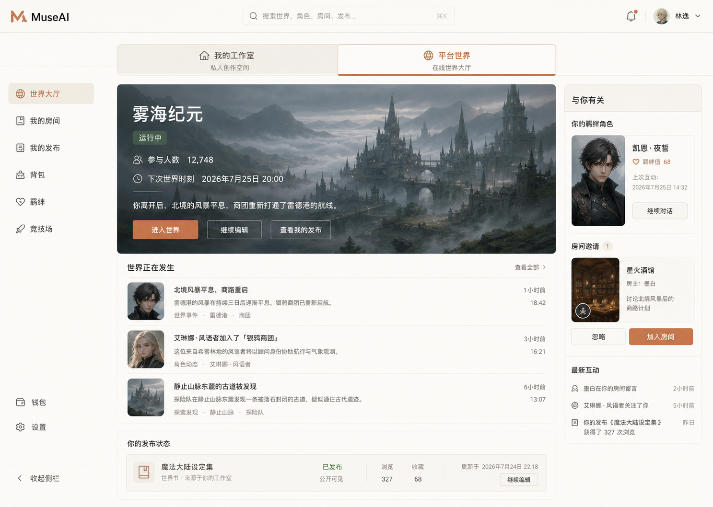
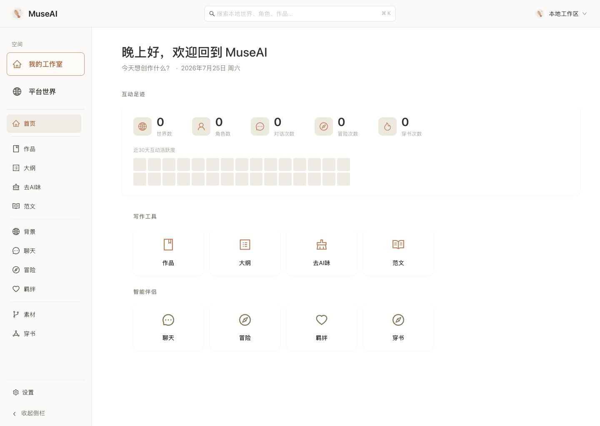
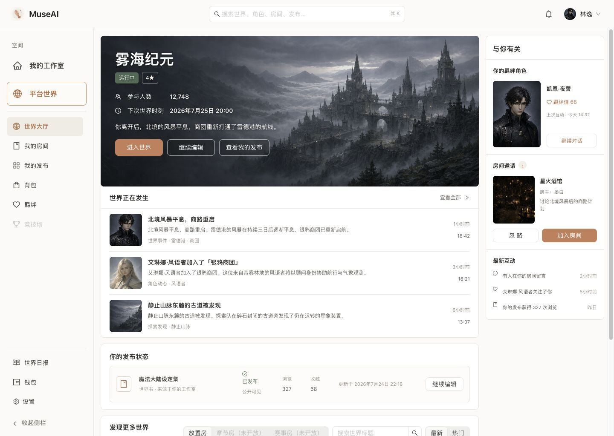
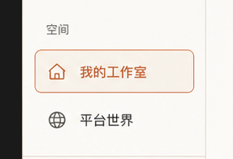
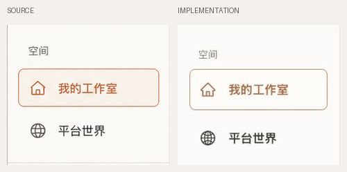

# MuseAI 客户端界面设计

> 状态：已实现并通过视觉验收  
> 适用范围：桌面客户端、本地工作室、平台世界  
> 验收基线：1440 × 1024，设备像素比 1  
> 最后更新：2026-07-25

## 1. 设计结论

客户端采用“双空间、单客户端”结构：

- **我的工作室**：本地创作与个人资料空间，免登录、离线优先，不因平台状态被锁定。
- **平台世界**：登录后进入的云端世界、角色、资产与互动空间。
- **空间切换**：固定在左侧栏左上区域，以纵向按钮呈现；不再使用占据主内容高度的横向切换条。

这套结构让普通用户功能尽量留在客户端，同时明确区分本地数据和云端数据。审核、风控、模型治理等管理能力不进入客户端，继续由独立后台承担。

## 2. 视觉参考与最终实现

### 2.1 整体参考

### 2.2 最终页面

### 2.3 空间切换参考与对照

完整页面对照见：[client-full-compare.png](./assets/client-full-compare.png)。

## 3. 信息架构

| 层级 | 我的工作室 | 平台世界 |
|---|---|---|
| 身份状态 | 默认可进入，不要求平台账号 | 未登录时进入平台登录页，登录后进入大厅 |
| 主要任务 | 本地世界与角色创作、故事、对话、冒险、素材管理 | 发现世界、参与互动、我的世界、角色资产、发布与钱包 |
| 数据归属 | 用户本地目录与 Tauri 本地能力 | 平台账号及云端服务 |
| 导航归属 | 复用本地客户端侧栏 | 使用平台空间侧栏 |
| 管理能力 | 不包含 | 不包含；统一进入独立管理后台 |

## 4. 页面布局规格

### 4.1 全局框架

| 区域 | 规格 | 说明 |
|---|---|---|
| 顶栏 | 高 66px | 品牌、全局搜索、通知与账号入口 |
| 左侧栏 | 宽 220px | 空间切换、当前空间导航、设置与收起入口 |
| 空间切换按钮 | 高 56px，间距 10px，圆角 8px | 激活态使用陶土色描边与浅暖背景 |
| 主内容 | 自适应宽度 | 暖白背景，内容区独立滚动 |
| 平台大厅 | 最大宽度约 1220px | 主栏与 278px 辅助栏，间距 16px |

### 4.2 左上角空间切换

- 分组标题使用“空间”，字号 13px，弱化为辅助信息。
- “我的工作室”和“平台世界”均使用图标 + 文字的纵向按钮。
- 当前空间使用 `#df8b69` 描边、`#fffaf7` 背景和 `#c96542` 文字。
- 切换控件必须在两个空间中保持相同位置和尺寸，避免用户切换后重新寻找入口。
- 键盘聚焦态使用 2px 高可见轮廓，不能仅依赖颜色表示状态。

## 5. 视觉系统

| 用途 | 颜色/样式 |
|---|---|
| 页面底色 | `#fbfaf7` 暖白 |
| 卡片底色 | `#ffffff` |
| 主文字 | `#292724` / `#34312d` |
| 次级文字 | `#80786f` / `#938b82` |
| 品牌强调 | `#d97757` / `#c66f4d` |
| 分隔线 | `#e8e3dc` / `#ebe6df` |
| 选中背景 | `#f1ece4` 或 `#fffaf7` |
| 常用圆角 | 7–9px；不使用过度胶囊化卡片 |
| 中文字体 | 系统中文无衬线字体，兼容 PingFang SC、Hiragino Sans GB、Microsoft YaHei |

视觉气质保持安静、温暖、内容优先。客户端不是游戏大厅式的高饱和界面，也不使用大量发光、渐变和装饰性图标干扰长期创作。

## 6. 平台大厅组成

- 顶部主视觉世界：世界封面、状态、参与人数、最近活动和主要操作。
- 世界动态：以可点击事件条目呈现，不把所有信息挤进卡片网格。
- 世界目录：提供继续探索入口。
- 右侧辅助栏：发布状态、相关世界及必要的账号提示。
- 所有可见世界封面使用真实位图资产；不使用占位框、Emoji 或 CSS 绘图替代。

## 7. 核心交互

### 空间切换

1. 用户在左侧栏点击“平台世界”。
2. 已登录时进入平台大厅；未登录时进入平台登录页。
3. 用户点击“我的工作室”后返回本地客户端主页。
4. 切换不改变本地模式免登录的产品承诺。

### 平台大厅

- 主视觉世界和事件条目均可进入对应世界详情或互动路径。
- 全局搜索、账号菜单、通知和侧栏导航保持一致位置。
- 加载、空数据和接口异常状态必须在主内容区说明原因，并提供恢复入口。

## 8. 响应式与可访问性

- 当前桌面客户端以宽屏生产力界面为主；1440px 为视觉验收基线。
- 1180px 以下收紧顶栏三列宽度；980px 以下隐藏账号按钮中的次要文字。
- 主内容使用 `min-width: 0` 和独立滚动，避免双栏内容把整个窗口撑出横向滚动。
- 空间按钮、世界条目和主操作均保留键盘聚焦态。
- 颜色状态同时配合文字或图标，不依赖红绿颜色单独传达。

## 9. 实现映射

| 能力 | 主要文件 |
|---|---|
| 客户端入口与路由 | `src/App.tsx` |
| 本地工作室外壳 | `src/components/AppShell.tsx`、`src/components/AppShell.css` |
| 平台外壳与空间切换 | `src/pages/platform/PlatformShell.tsx`、`src/pages/platform/PlatformShell.css` |
| 平台大厅 | `src/pages/platform/PlatformHall.tsx`、`src/pages/platform/PlatformHall.css` |
| 平台登录 | `src/pages/platform/PlatformLogin.tsx` |
| 本地主页 | `src/pages/Home.tsx` |

开发验收预览：`http://127.0.0.1:1420/platform?design=preview`。

## 10. 验收记录

- 已验证本地工作室与平台世界双向切换。
- 未登录进入平台时会进入平台登录页，本地空间仍可直接使用。
- 空间切换与用户提供的左上角纵向参考完成并排对照。
- 本地工作室、平台登录页和平台大厅的新标签页控制台 warning/error 为 0。
- 相关回归测试 3 个文件、8 项通过；正式构建通过。
- 最终视觉问题：P0 无、P1 无、P2 无；仅保留系统字体与图标笔画的轻微 P3 差异。

## 11. 后续设计约束

- 新增普通用户功能时，先判断属于本地工作室还是平台世界，不新增第三套平级空间。
- 涉及审核、封禁、模型路由、Prompt 发布、全局指标的功能进入管理后台，不塞入客户端设置页。
- 云端同步必须明确展示数据归属、同步状态和冲突处理，不能让用户误以为本地内容已自动上传。
- 当前宽屏设计不等于移动端已完成；如果启动移动端开发，应独立定义信息密度和底部导航，而不是机械缩放桌面侧栏。

## 验收结论

**视觉验收：通过**——P0/P1/P2 均无，仅余系统字体与图标笔画的 P3 差异（见 §10）。

> **状态语言**（`docs/VALIDATION.md` §0 七档）：本文所述界面处于 **Implemented**——
> 结构与视觉规格已落地并通过对照验收。这**不等同于** `Production-ready`，更不等同于 `Validated`：
> 视觉验收只证明"长得对"，不证明数据接线完整、接口口径稳定或用户价值成立。
> 各页面的数据接线完成度以 §9 实现映射为准；能否对用户开放按 `docs/VALIDATION.md` 的 T0-T5 分阶段开闸。
