# 玩家端 6.2 Image 2 视觉稿

> 状态：视觉设计、前端路由与 API 接线已完成；本地视觉/交互 QA 通过，生产仍受 feature flag 与环境配置控制 
> 视觉方向：方案 1「旅程罗盘」 
> 生成日期：2026-07-27 
> 验收基线：1440 × 1024，设备像素比 1

## 1. 范围与状态边界

本设计集对应 [`PROJECT_FUNCTION_IMPLEMENTATION_REPORT.md`](../PROJECT_FUNCTION_IMPLEMENTATION_REPORT.md) §6.2 中“已有后端但玩家 UI 尚未完整接入”的九类能力：

1. 新手引导预设、状态、礼包和微世界；
2. 房间邀请的获取与处理；
3. OOC 申诉和私人批注；
4. IFLine 平行线分叉与推进；
5. 副本卡列表与合成；
6. 纪念堂、印记与封卷；
7. 真人身份双向解锁；
8. 章节开始/结束、离线收益与携带；
9. Live Stage 节目单、直播 Feed 与弹幕。

本文件同时记录视觉源与 2026-07-28 的前端实现结果。九类页面已编码、路由已注册，正式模式调用真实 API；`?design=preview` 只承载可复现样例。对应后端能力仍受各自的 feature flag、年龄门、准入规则和生产配置约束，因此“前端已实现”不等于“生产已开放”。

## 2. 统一视觉方向

选择方案 1「旅程罗盘」作为全部页面的视觉母版：

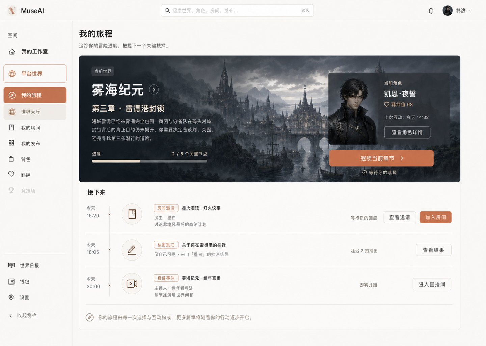

共同约束：

- 复用 66px 顶栏、220px 侧栏和“我的工作室 / 平台世界”空间切换；
- 新能力统一归入“我的旅程”，不再新增第三套平级产品空间；
- 使用暖白底色、陶土色主操作、深灰正文和细米色分隔线；
- 每页只突出一个核心任务，避免把后端端点堆成控制台；
- 把“公共事实不可回滚”“邀请不绕过准入”“付费不买结果”“面具默认”等规则直接写入玩家界面；
- 所有世界图、人物图和物品图均使用真实位图视觉，不使用 Emoji、占位框或 CSS 绘图。

## 3. 九类完整页面

### 3.1 新手引导与新人礼包

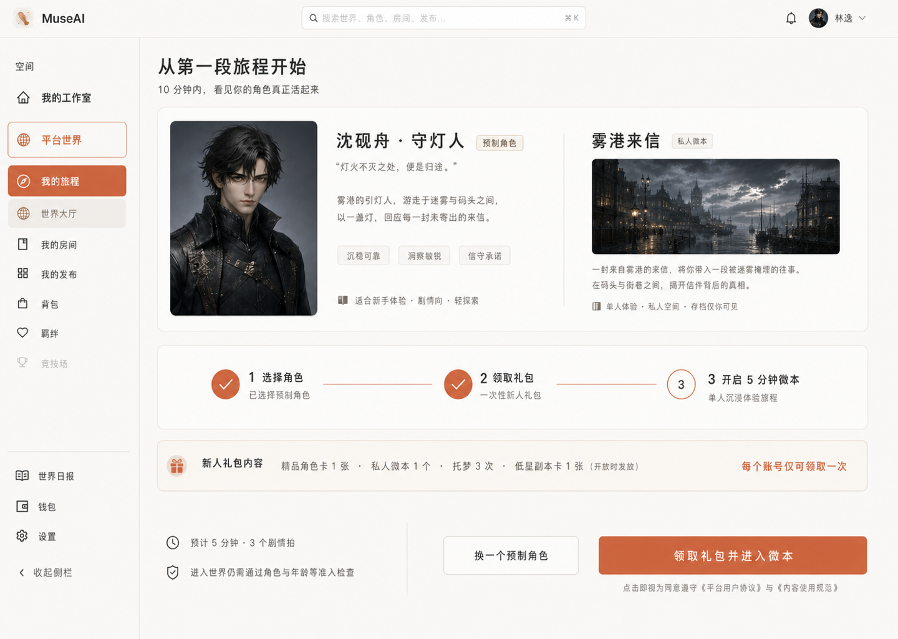

| 项目 | 设计落点 |
|---|---|
| 核心任务 | 选择预制角色，领取一次性礼包，进入 5 分钟私人微本 |
| 主要操作 | `领取礼包并进入微本` |
| 关键边界 | 礼包不绕过角色、人数、星级、同源、年龄和契约准入 |
| 后端入口 | `GET /api/onboarding/presets`、`POST /api/me/onboarding/gift`、`GET /api/me/onboarding`、`POST /api/me/onboarding/microworld/start` |

### 3.2 房间邀请

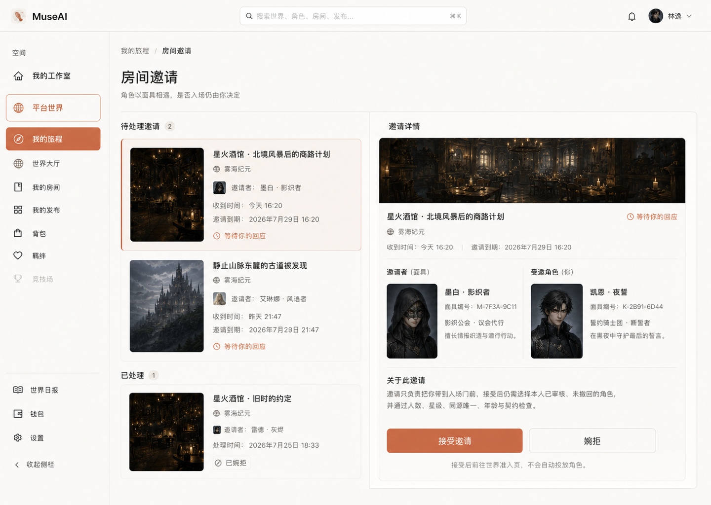

| 项目 | 设计落点 |
|---|---|
| 核心任务 | 识别邀请者角色面具、受邀角色和目标世界，接受或婉拒 |
| 主要操作 | `接受邀请` |
| 关键边界 | 接受只进入世界准入页，不自动投放角色，不写 `world_members` |
| 后端入口 | `POST/GET /api/worlds/{id}/invitations`、`GET /api/me/invitations`、`POST /api/me/invitations/{id}/respond` |

### 3.3 OOC 申诉与私人批注

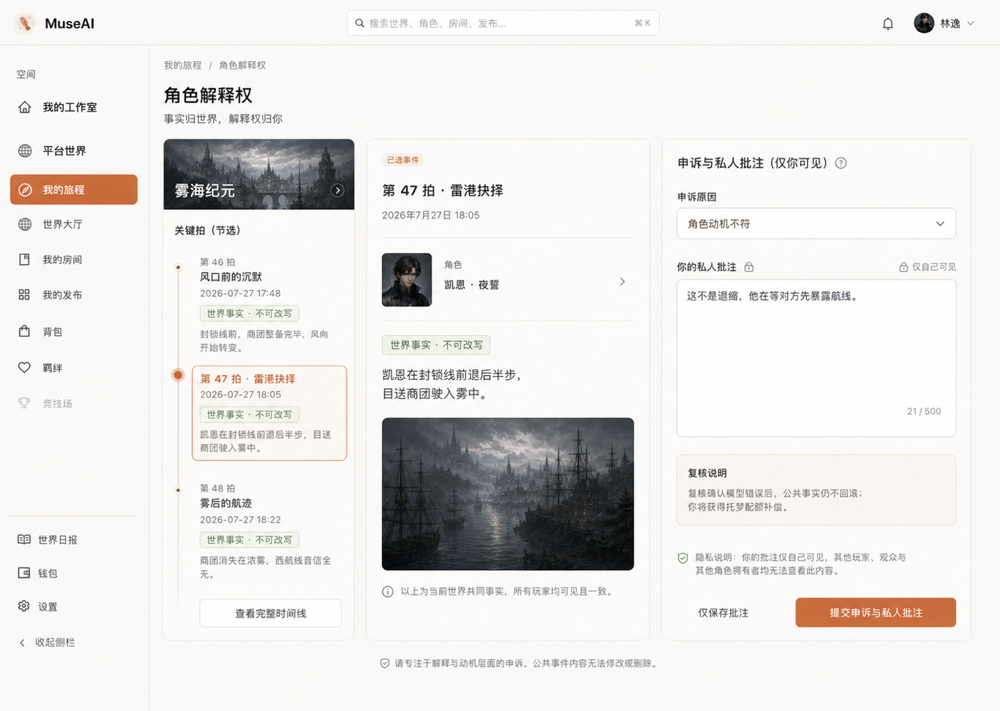

| 项目 | 设计落点 |
|---|---|
| 核心任务 | 对单拍角色行为提交 OOC 申诉，并保存仅本人可见的解释 |
| 主要操作 | `提交申诉与私人批注` |
| 关键边界 | 公共事实不修改；复核确认模型错误后补偿托梦配额 |
| 后端入口 | `POST /api/worlds/{id}/ooc-appeals`、`GET/PUT /api/me/ooc-appeals`、`GET /api/me/characters/{id}/annotations` |

### 3.4 IFLine 私人平行线

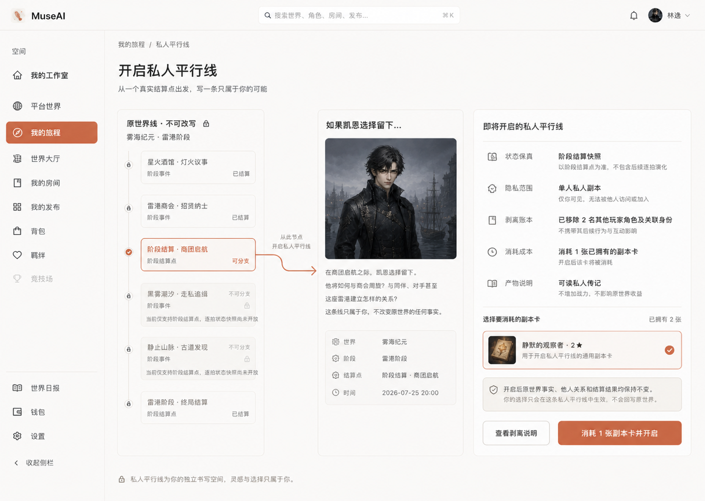

| 项目 | 设计落点 |
|---|---|
| 核心任务 | 选择真实可用分叉点，查看保真度与剥离台账，消耗副本卡开启私人线 |
| 主要操作 | `消耗 1 张副本卡并开启` |
| 关键边界 | 当前明确展示阶段结算快照限制；平行线不改写原世界、不增加战力 |
| 后端入口 | `GET /api/worlds/{id}/ifline-fork-points`、`POST /api/worlds/{id}/iflines`、`GET/POST /api/me/iflines` |

### 3.5 副本卡收藏与合成

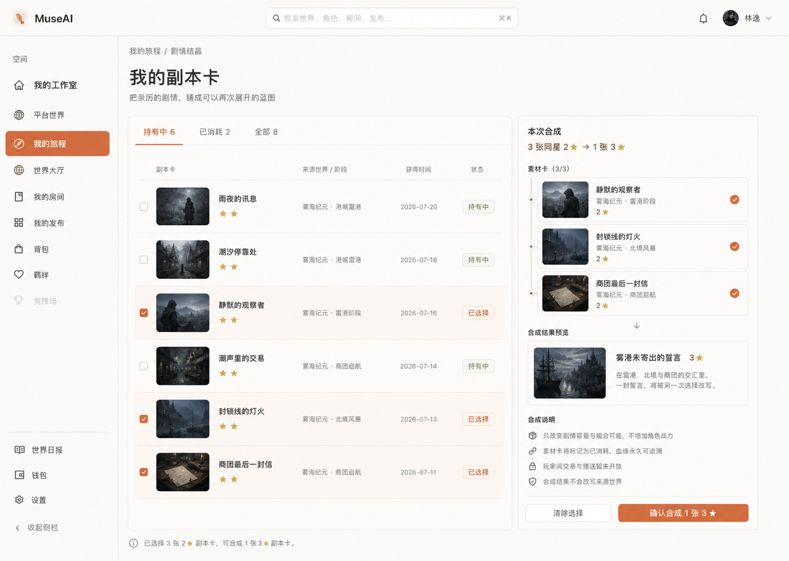

| 项目 | 设计落点 |
|---|---|
| 核心任务 | 选择同星副本卡，查看来源与血缘，合成更高星剧情蓝图 |
| 主要操作 | `确认合成 1 张 3★` |
| 关键边界 | 合成不增加战力；素材转为已消耗；交易与赠送暂不开放 |
| 后端入口 | `GET /api/me/subplot-cards`、`POST /api/me/subplot-cards/synthesize` |

### 3.6 传世卡封卷与遗作馆

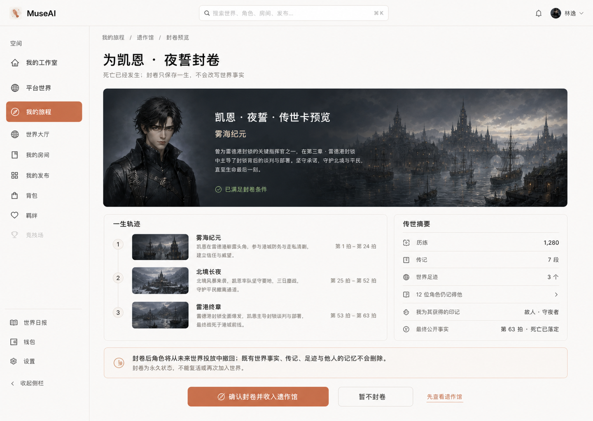

| 项目 | 设计落点 |
|---|---|
| 核心任务 | 查看死亡角色的一生轨迹与传世卡预览，决定是否永久封卷 |
| 主要操作 | `确认封卷并收入遗作馆` |
| 关键边界 | 死亡事实不回滚；封卷后角色撤回，既有传记、足迹和他人记忆保留 |
| 后端入口 | `GET /api/memorial/characters`、`GET /api/memorial/characters/{id}`、`GET /api/me/memorial/marks`、`POST /api/me/characters/{id}/memorial` |

### 3.7 真人身份双向解锁

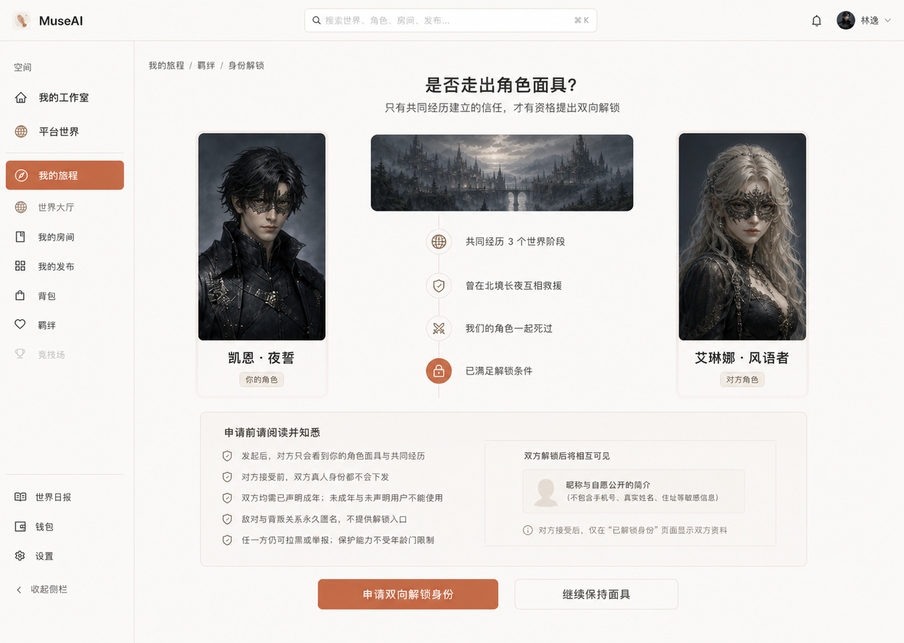

| 项目 | 设计落点 |
|---|---|
| 核心任务 | 基于共同经历发起双向解锁，等待对方同意后再显示自愿公开资料 |
| 主要操作 | `申请双向解锁身份` |
| 关键边界 | 面具默认；双方成年；敌对线永久匿名；拉黑与举报始终可用 |
| 后端入口 | `GET /api/worlds/{id}/social/bonds`、`POST /api/worlds/{id}/social/unlock-requests`、`GET/POST /api/me/social/unlock-requests`、`GET /api/me/social/identities` |

### 3.8 章节房与离线收益

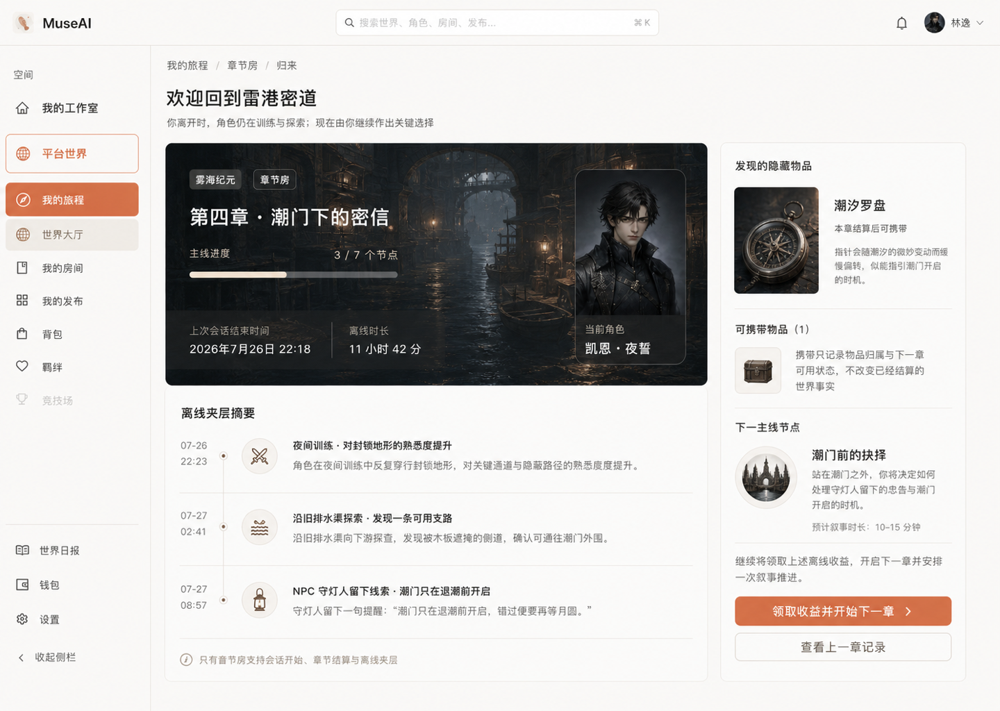

| 项目 | 设计落点 |
|---|---|
| 核心任务 | 阅读离线夹层摘要，确认隐藏物品，领取收益并开始下一章 |
| 主要操作 | `领取收益并开始下一章` |
| 关键边界 | 只在章节房生效；离线摘要不是新公共事实；携带不改写既有结算 |
| 后端入口 | `POST /api/worlds/{id}/chapters/start`、`POST /api/worlds/{id}/chapters/finish`、`GET /api/worlds/{id}/offline-gains`、`POST /api/worlds/{id}/carry` |

### 3.9 Live Stage 直播场

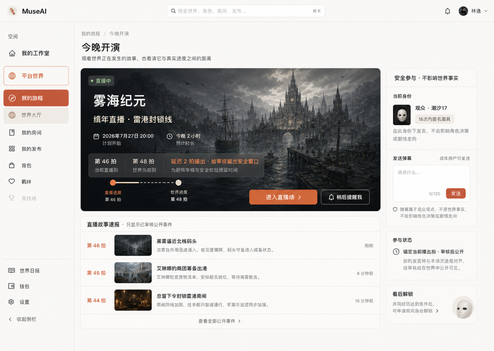

| 项目 | 设计落点 |
|---|---|
| 核心任务 | 看懂节目时间、播出拍与真实世界拍的差异，进入安全延迟直播并以面具发言 |
| 主要操作 | `进入直播场` |
| 关键边界 | 直播延迟给审核留窗口；弹幕不是世界事实，不影响角色决策和剧情 |
| 后端入口 | `GET /api/live/sessions`、`GET /api/live/sessions/{id}`、`GET /api/live/sessions/{id}/feed`、`GET/POST /api/live/sessions/{id}/danmaku` |

## 4. 生成完整性

| 编号 | 文件 | 尺寸 | 状态 |
|---:|---|---:|---|
| 00 | `00-direction-journey-compass.png` | 1440 × 1024 | 选定视觉母版 |
| 01 | `01-onboarding-gift.png` | 1440 × 1024 | 已生成 |
| 02 | `02-room-invitations.png` | 1440 × 1024 | 已生成 |
| 03 | `03-ooc-annotations.png` | 1440 × 1024 | 已生成 |
| 04 | `04-ifline-parallel-story.png` | 1440 × 1024 | 已生成 |
| 05 | `05-subplot-cards.png` | 1440 × 1024 | 已生成 |
| 06 | `06-memorial-sealing.png` | 1440 × 1024 | 已生成 |
| 07 | `07-social-identity-unlock.png` | 1440 × 1024 | 已生成 |
| 08 | `08-chapters-offline-gains.png` | 1440 × 1024 | 已生成 |
| 09 | `09-live-stage.png` | 1440 × 1024 | 已生成 |

## 5. 已实现落点与运行边界

- 统一入口：`/platform/journey`；九个子路由分别为 `onboarding`、`invitations`、`ooc`、`iflines`、`subplot`、`memorial`、`social`、`chapters`、`live`。
- 代码：`src/pages/platform/journey/`；共享正式 API 客户端为 `src/utils/cloudApi.ts`。
- 正式访问读取真实数据并执行真实写端点；仅开发环境 `?design=preview` 使用样例数据，且页面明确标识。
- 平台外壳保留 66px 顶栏和 220px 桌面侧栏，并新增手机抽屉导航，避免窄屏静默切走 `/platform/*`。
- 物品图使用 `public/assets/journey/mist-sea-compass.png`；人物与世界继续复用项目真实位图。

## 6. 验收结果

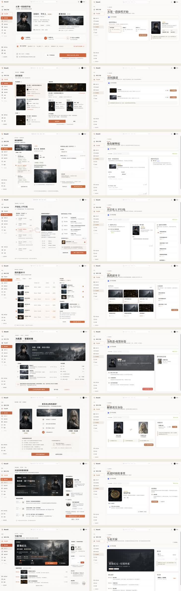

- 1440×1024 九页逐一对照完成；桌面、768px 平板和 390px 手机均无横向溢出。
- 开场礼、邀请处理、封卷二次确认、直播弹幕等关键交互已在本地浏览器点通。
- `npm run build` 通过；`npm test` 共 81 个测试文件、502 个测试通过。
- 根目录 `design-qa.md` 的最终结论为 `passed`。
- 尚未覆盖：开启全部 feature flag 的真实多用户后端环境、真实供应商和生产发布验证。
